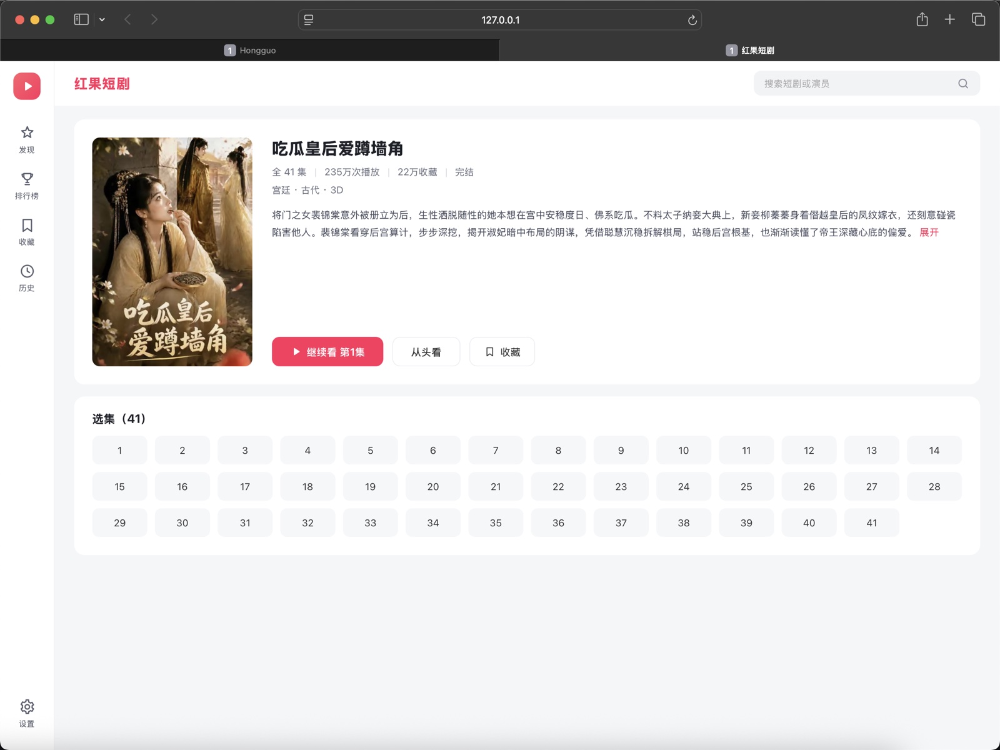
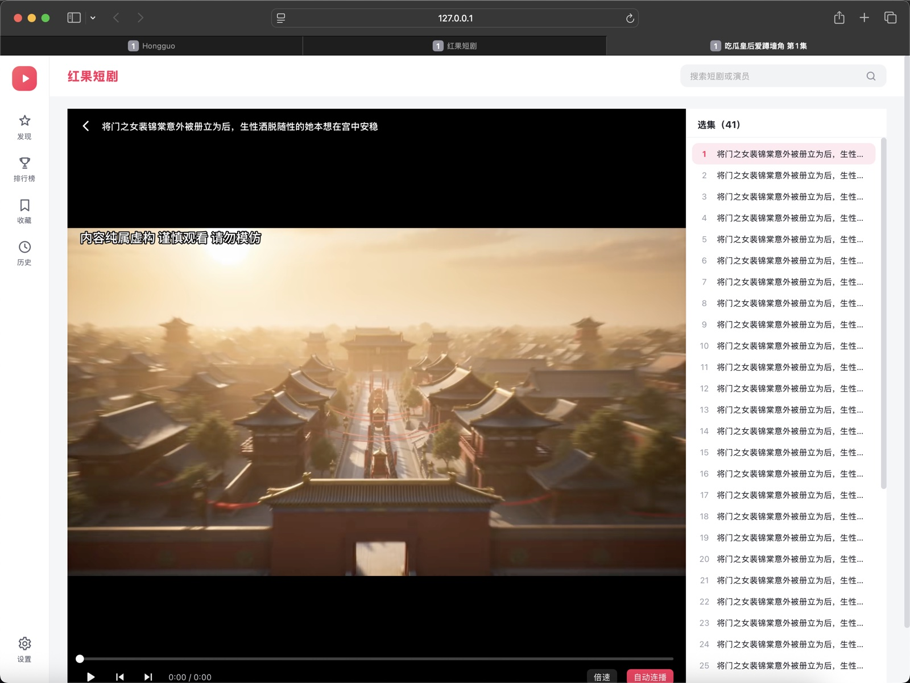
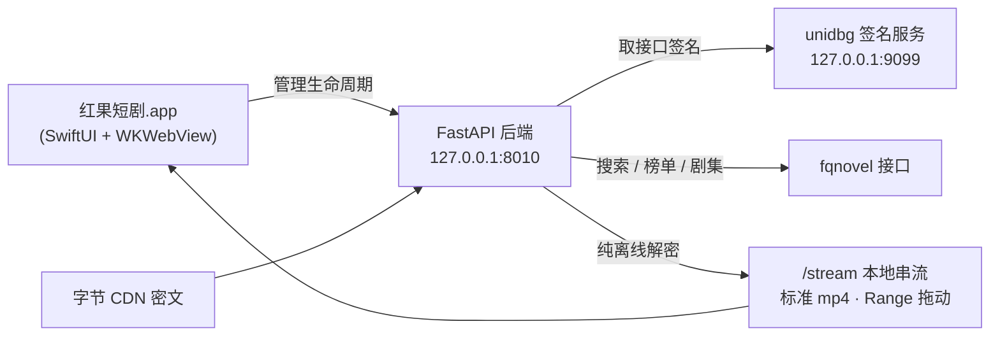

<div align="center">


# 红果短剧 · Mac 自研适配版

**在 Mac 上原生刷短剧 —— 独立 App · 选集连播 · 倍速续播 · 本机收藏历史**

[](../../releases/latest)
[](../../actions)
[](../../releases/latest)
[](LICENSE)

**一键安装 · 无需 Homebrew · 无需开发者工具**

[🚀 立即下载](../../releases/latest) · [📖 安装说明](#-一键安装) · [❓ 常见问题](#-常见问题)


*发现页：分类筛选 / 热播榜 / 真人剧 · 漫剧 · AI剧（截图中剧目封面来自内容服务，版权归原权利方）*

</div>

---

> ⚠️ **非官方声明**：本项目为个人自研的第三方桌面适配版，与字节跳动 / 红果短剧官方**无任何关系**，仅供个人学习研究，请勿商用。内容版权归原权利方所有。完整说明见[文末免责声明](#%EF%B8%8F-免责声明)。

## ✨ 为什么做这个

红果短剧官方只有手机 App 和 Windows 版 —— **Mac 用户一直是二等公民**。
这个项目把整套体验搬到了 macOS 上：不是套壳网页，而是原生 Swift 窗口 + 本地后端的完整适配。

| | 手机 App | 官方 Windows | **Mac 自研适配版** |
|---|:---:|:---:|:---:|
| 原生窗口 / Dock 图标 | — | ✔ | ✔ |
| 分类发现 / 榜单 / 搜索 | ✔ | ✔ | ✔ |
| 选集 · 倍速 · 自动连播 | ✔ | ✔ | ✔ |
| 断点续播（从上次位置继续） | ✔ | ✔ | ✔ |
| 本机收藏 / 观看历史 | 需登录 | 本机 | **本机 · 免登录** |
| 退出即收后端，不留后台 | — | ✗ | ✔ |

## 📸 界面一览

| 详情页 | 播放页 |
|---|---|
|  |  |
| 评分 / 播放量 / 简介 / 全集选集 | 选集抽屉 · 倍速 · 自动连播 · 进度拖动 |

## 🚀 一键安装

**要求**：macOS 13+（Apple Silicon 或 Intel）。不需要 Homebrew，不需要开发者工具。

1. 到 [**Releases**](../../releases/latest) 下载 `setup_mac.command`
2. **右键 → 打开**（首次需此操作通过 Gatekeeper 校验；终端党也可 `bash setup_mac.command`）
3. 等 3–5 分钟（拉取后端组件、下载 JRE、装依赖），完成后自动打开 App

<details>
<summary>安装脚本做了什么（全程可审计）</summary>

| 步骤 | 内容 |
|---|---|
| 1 | 拉取本仓库（补丁 / UI / 壳源码） |
| 2 | 克隆上游后端 [zhangbaio/hongguo](https://github.com/zhangbaio/hongguo)（锁定 commit `5f8a58d10f`） |
| 3 | 组装 `~/hongguo-mac/run`（后端 + 签名服务） |
| 4 | 下载 Temurin JRE 17（Adoptium 官方源） |
| 5 | Python venv + 依赖（fastapi / uvicorn / pycryptodome / pillow） |
| 6 | 应用 mac 适配补丁（3 处小改动，见 `scripts/patches/`） |
| 7 | 获取 App（优先 Release 产物，失败则本地 swiftc 构建） |

</details>

## 🏗️ 架构



- **壳**（本仓库自有代码）：SwiftUI 原生窗口，负责拉起/收掉两个本地服务，WKWebView 承载界面
- **后端**：上游公开仓库提供，本仓库打 3 个适配补丁；视频在本地解密后以标准 mp4 串流
- **播放体验**：首次播放某集需下载解密（数秒），之后秒开；支持 Range 拖动

## 🛠 手动构建壳 App

```bash
xcode-select --install    # 如未装命令行工具
git clone https://github.com/zerozhh/hongguo-mac.git
cd hongguo-mac/app && bash build.sh   # 产物 app/dist/红果短剧.app(内部名 Hongguo.app)
```

## ❓ 常见问题

<details>
<summary><b>打开提示"已损坏"或无法验证开发者？</b></summary>
本项目无付费开发者签名（ad-hoc）。终端执行：<code>xattr -dr com.apple.quarantine /Applications/Hongguo.app</code>，或安装脚本已自动处理。
</details>

<details>
<summary><b>搜索突然为空 / 播放失败？</b></summary>
接口为非官方调用，可能被风控。重启 App 再试；仍失败说明临时失效，等恢复即可。
</details>

<details>
<summary><b>观看记录会和手机同步吗？</b></summary>
不会。收藏与历史仅保存在本机，与任何账号无关。
</details>

<details>
<summary><b>如何卸载？</b></summary>
<pre><code>rm -rf ~/hongguo-mac ~/Library/Caches/local.hongguo.desktop ~/Library/WebKit/local.hongguo.desktop
sudo rm -rf /Applications/Hongguo.app  # 或在应用程序文件夹拖入废纸篓</code></pre>
</details>

## 🙏 致谢

- [zhangbaio/hongguo](https://github.com/zhangbaio/hongguo) —— 后端与签名能力的公开实现，本项目的主要依赖
- [waligoraamodio288-rgb/hongguo-desktop-releases](https://github.com/waligoraamodio288-rgb/hongguo-desktop-releases) —— Windows 版发行仓库，本项目的参照
- [unidbg](https://github.com/zhkl0228/unidbg)、[Temurin](https://adoptium.net)、FastAPI / uvicorn / pycryptodome 等开源组件（详见 [NOTICE.md](NOTICE.md)）

## ⚠️ 免责声明

1. 本项目是**个人自研的第三方适配版本**，与字节跳动 / 红果短剧官方无任何关系；"红果短剧"名称、logo 及全部剧集内容版权归原权利方所有，本项目仅作描述性使用。
2. 仅供个人学习研究，**请勿用于商业用途**，请勿二次分发打包产物，请勿公开传播。
3. 接口与内容可用性取决于第三方服务，**随时可能失效**；使用产生的全部风险由使用者自担。
4. 如权利方认为本项目侵犯权益，请提 Issue，将第一时间配合处理（下架 / 转私有）。

## License

本仓库自有代码：[MIT](LICENSE) · 上游引用与运行时组件：[NOTICE.md](NOTICE.md)

---

<div align="center">

**如果这个项目帮到了你，欢迎点个 ⭐ Star**

</div>
